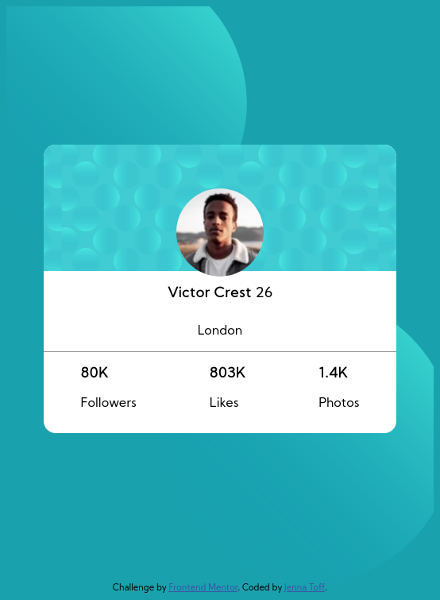

# Frontend Mentor - Profile card component solution

This is a solution to the [Profile card component challenge on Frontend Mentor](https://www.frontendmentor.io/challenges/profile-card-component-cfArpWshJ). Frontend Mentor challenges help you improve your coding skills by building realistic projects. 

## Table of contents

- [Overview](#overview)
  - [The challenge](#the-challenge)
  - [Screenshot](#screenshot)
  - [Links](#links)
- [My process](#my-process)
  - [Built with](#built-with)
  - [What I learned](#what-i-learned)
  - [Continued development](#continued-development)
- [Author](#author)

## Overview

### The challenge

- Build out the project to the designs provided

### Screenshot

### Links

- Solution URL: [FrontendMentor Solution](https://www.frontendmentor.io/challenges/profile-card-component-cfArpWshJ/hub/just-css-jaFPdDsnO)
- Live Site URL: [GitHub](https://larkceresin.github.io/FM-card/index.html)

## My process

### Built with

- Semantic HTML5 markup
- CSS custom properties
- Flexbox
- Absolute Positioning
- Desktop-first workflow

### What I learned

Revisitng CSS and HTML basics.
Have realized there are things with positioning that I need to work on to improve further.

### Continued development

Working more on learning more of what CSS can do and to come up with the correct direction.

## Author

- Frontend Mentor - [@larkceresin](https://www.frontendmentor.io/profile/larkceresin)
- Twitter - [@shamanlvr](https://www.twitter.com/shamanlvr)

